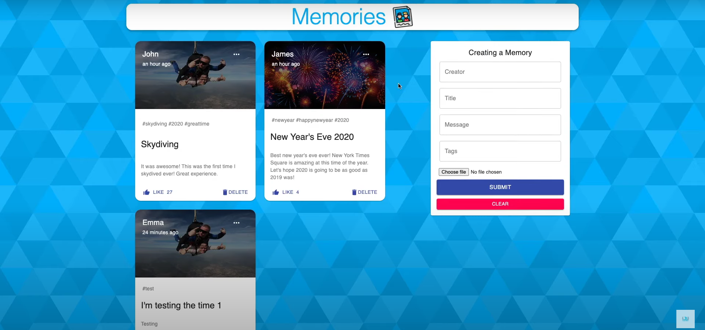
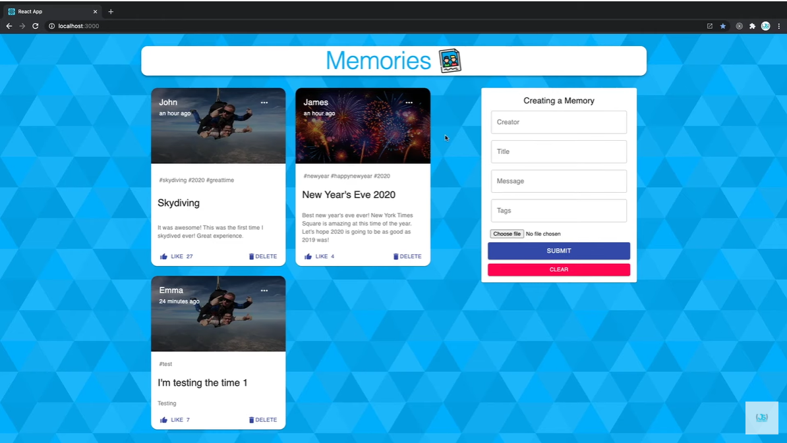

# Memories 
## Mastering MERN stack by building projects. 
### This project made the concept of MERN stack crystal clear to me.
# Most Scalable code ever!!!
#### I have also added the detailed explanation of the entire code.

# Memories

## Introduction

Using React, Node.js, Express & MongoDB you'll learn how to build a Full Stack MERN Application - from start to finish. The App is called "Memories" and it is a simple social media app that allows users to post interesting events that happened in their lives.Deployment of frontend at netifly and backend at heroku

It helped me to have a strong understanding of how the MERN Stack works.
Styling has been done using material-UI.

